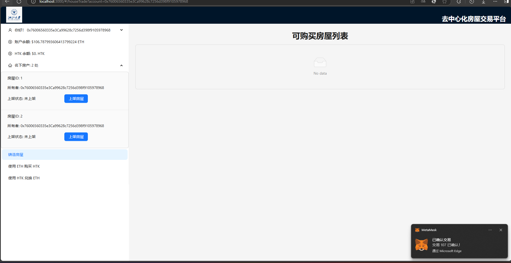

# MY-ZJU-blockchain-course-2024

## 项目介绍

### 概述

本项目是一个基于以太坊区块链的去中心化房屋交易平台，用户可以通过该平台进行房屋的挂牌出售、购买、领取所有权等操作。平台通过智能合约自动执行交易流程，确保房屋所有权的转移安全可靠。此外，所有交易和数据都保存在区块链上，保证了数据的透明性和不可篡改性。

### 功能介绍

*我的系统中测试以太币命名为ETH，ERC20代币命名为HTK（HouseToken）*

#### 每个普通用户：

- 用户查看自己拥有的房产列表。并可以挂单出售自己的房屋（挂单包含价格等信息）。
- 用户查看所有出售中的房产，并可以看到一栋房产的主人，及各种挂单信息。
- 用户选择支付房屋价格对应的ETH/HTK，购买某个其他用户出售的房产。购买后房产拥有权发生变化。
- 平台收取手续费：在一个房产出售完成时，用户支付的部分ETH或者HTK（=某栋房产在平台上的挂单天数* 5%% * 房产价格）会被作为手续费转给平台部署者

#### 平台部署者:

- 普通用户的所有权限
- 可以为任何人铸造房屋

#### bonus

- 本实验中发行了一个（ERC20）合约，允许用户将ETH兑换成HTK（ERC20积分），并使用HTK完成购买房屋的流程。
- 提供了ETH兑换HTK的接口
- 提供了HTK兑换ETH的接口

### 实现分析

该去中心化房屋购买系统通过 BuyMyRoom 和 HTKToken 两个合约来实现，以下结合代码介绍系统的核心功能和设计思路。

1. 房产管理与操作 (BuyMyRoom 合约)
    - 房产铸造

        ```solidity
        function mintHouse(address to) external {
            require(msg.sender == platformOwner, "Only the platform owner can mint");
            houseCount++;
            _mint(to, houseCount);
            houses[houseCount] = House({
                owner: to,
                price: 0,
                listedTimestamp: 0,
                isForSale: false
                });
            ownerHouses[to].push(houseCount); // 记录新房产到所有者的列表
        }
        ```
      只有平台所有者可以调用 `mintHouse` 函数铸造新房产。每次调用时，`houseCount` 自增以生成唯一的 `tokenId` 并添加到
      `houses `映射，记录房产的基本信息。通过 `ownerHouses` 映射记录房产持有者的所有房产 `tokenId`

    - 房产挂牌

        ```solidity
        function listHouseForSale(uint256 tokenId, uint256 price) external {
            require(ownerOf(tokenId) == msg.sender, "You are not the owner of this house");
            require(price > 0, "Price must be greater than zero");
     
            houses[tokenId].price = price;
            houses[tokenId].listedTimestamp = block.timestamp;
            houses[tokenId].isForSale = true;
     
            emit HouseListed(tokenId, price, msg.sender);
        }
        ```
      房屋拥有者通过 `listHouseForSale` 函数将房屋挂牌出售，设置房产价格和挂牌时间 `listedTimestamp`。挂牌成功后触发
      `HouseListed `事件
2. 房屋购买流程
    - 使用 ETH 购买房屋

        ```solidity
        function buyHouseWithETH(uint256 tokenId) external payable {
            require(houses[tokenId].isForSale, "House is not for sale");
            require(msg.value >= houses[tokenId].price, "Insufficient payment");
     
            address seller = ownerOf(tokenId);
            uint256 price = houses[tokenId].price;
     
            uint256 fee = calculateFee(tokenId);
            uint256 sellerAmount = price - fee;
     
            _transfer(seller, msg.sender, tokenId);
            payable(seller).transfer(sellerAmount);
            payable(platformOwner).transfer(fee);
     
            houses[tokenId].owner = msg.sender;
            houses[tokenId].isForSale = false;
            ownerHouses[msg.sender].push(tokenId);
            removeHouseFromOwner(seller, tokenId);
     
            emit HouseSold(tokenId, msg.sender, price);
        }
        ```
      `buyHouseWithETH` 函数检查房产是否挂牌，并确保支付足够 `ETH`。使用 `calculateFee` 计算手续费（下文详述），并将手续费上限设为房价的
      50%。支付后通过 `_transfer `将房产转移至买家，更新 `ownerHouses`，最后触发` HouseSold` 事件。

    - 使用 HTK 购买房屋

        ```solidity
     
        function buyHouseWithHTK(uint256 tokenId) external {
         require(houses[tokenId].isForSale, "House is not for sale");
         uint256 priceHTK = houses[tokenId].price*1000;
         address seller = ownerOf(tokenId);
         // 计算手续费，使用 calculateFee 函数
         uint256 feeHTK = calculateFeeHTK(tokenId);
         uint256 sellerAmount = priceHTK - feeHTK;
 
         //require(htkToken.balanceOf(msg.sender) >= priceHTK, "Insufficient HTK balance");
 
         // 使用 HTK 支付，并扣除手续费
         htkToken.transferFrom(msg.sender, ownerOf(tokenId), sellerAmount); // 卖家收到扣除手续费后的金额
         htkToken.transferFrom(msg.sender, platformOwner, feeHTK); // 平台所有者收到手续费
 
         _transfer(seller, msg.sender, tokenId);
 
         houses[tokenId].owner = msg.sender;
         houses[tokenId].isForSale = false;
 
         // 更新新所有者的房产列表
         ownerHouses[msg.sender].push(tokenId);
         removeHouseFromOwner(seller, tokenId);
 
         emit HouseSold(tokenId, msg.sender, priceHTK);  
        }
        ```
      该函数允许买方以 HTK 代币支付房屋价格，按 1 ETH = 1000 HTK 计算。手续费上限同样为房价的 50%，通过 `calculateFeeHTK`
      计算。使用 HTK 合约的 `transferFrom` 函数完成支付后，更新房产信息。

3. 手续费计算与上限设定
    - ETH 手续费计算

        ```solidity
        function calculateFee(uint256 tokenId) public view returns (uint256) {
            uint256 durationInDays = (block.timestamp - houses[tokenId].listedTimestamp) / 1 days;
            uint256 fee = houses[tokenId].price * feePercentage * durationInDays / 10000;
            uint256 maxFee = houses[tokenId].price / 2;
            return fee > maxFee ? maxFee : fee;
        }
        ```
      `calculateFee` 函数计算从挂牌至当前时间的累计手续费。手续费每日递增，maxFee 设为房产价格的一半，限制了手续费的上限。

    - HTK 手续费计算

        ```solidity
        function calculateFeeHTK(uint256 tokenId) public view returns (uint256) {
            uint256 durationInDays = (block.timestamp - houses[tokenId].listedTimestamp) / 1 days;
            uint256 feeHTK = houses[tokenId].price * 1000 * feePercentage * durationInDays / 10000;
            uint256 maxFeeHTK = houses[tokenId].price * 1000 / 2;
            return feeHTK > maxFeeHTK ? maxFeeHTK : feeHTK;
        }
        ```
      `calculateFeeHTK` 计算 HTK 支付方式的手续费，规则与 ETH 一致，将价格转换为 HTK 后再按天计费并设上限。

4. HTKToken 合约
    - HTK 代币的铸造与购买

        ```solidity
        function buyTokens() external payable {
            require(msg.value > 0, "ETH amount must be greater than zero");
            uint256 tokenAmount = msg.value * 1000;
            _mint(msg.sender, tokenAmount);
        }
        ```
      用户通过 buyTokens 函数以 ETH 购买 HTK 代币，每 1 ETH 转换为 1000 HTK。每次购买时系统会动态铸造新 HTK 代币，无需预先分配给平台

    - HTK 代币卖回 ETH

        ```solidity
        function sellTokens(uint256 amount) external {
            require(balanceOf(msg.sender) >= amount, "Insufficient HTK balance");
            _burn(msg.sender, amount);
            payable(msg.sender).transfer(amount* 10 ** decimals()/1000);
        }
        ```
      用户通过 sellTokens 将 HTK 卖回 ETH，系统销毁用户的 HTK 并返还等值的 ETH

5. 用户房产查询

   - 查看挂牌房屋
      ```solidity
      function getHousesForSale() external view returns (HouseWithTokenId[] memory) {
          uint256 count = 0;
          for (uint256 i = 1; i <= houseCount; i++) {
              if (houses[i].isForSale) {
              count++;
              }
          }
          HouseWithTokenId[] memory forSaleHouses = new HouseWithTokenId[](count);
          uint256 index = 0;
          for (uint256 i = 1; i <= houseCount; i++) {
              if (houses[i].isForSale) {
                  forSaleHouses[index] = HouseWithTokenId({
                      tokenId: i,
                      owner: houses[i].owner,
                      price: houses[i].price,
                      listedTimestamp: houses[i].listedTimestamp,
                      isForSale: houses[i].isForSale
                  });
              index++;
              }
          }
          return forSaleHouses;
      }
      ```
     getHousesForSale 返回当前所有挂牌的房屋信息列表。

- 查看个人房产
     ```solidity
     function getMyHouses() external view returns (HouseWithTokenId[] memory) {
         uint256[] memory myHouseIds = ownerHouses[msg.sender];
         HouseWithTokenId[] memory myHouses = new HouseWithTokenId[](myHouseIds.length);
      
         for (uint256 i = 0; i < myHouseIds.length; i++) {
             uint256 tokenId = myHouseIds[i];
             myHouses[i] = HouseWithTokenId({
                 tokenId: tokenId,
                 owner: houses[tokenId].owner,
                 price: houses[tokenId].price,
                 listedTimestamp: houses[tokenId].listedTimestamp,
                 isForSale: houses[tokenId].isForSale
             });
         }
         return myHouses;
     }
     ```
  getMyHouses 返回调用者持有的房屋信息，包括价格、挂牌状态等详细信息。

## 运行方式

1. 克隆本仓库
2. 下载并且运行ganache
    1. 记录ganache中的`RPC server`以及选择一个账户作为平台部署者，记录他的私钥
    2. 修改`/contracts/hardhat.config.ts`中的`url`为`RPC server`的值
    3. 修改`/contracts/hardhat.config.ts`中`accounts`为你记录的私钥值
3. 安装合约依赖、编译、部署合约

```
cd contracts

npm install hardhat
npx hardhat compile
npx hardhat run scripts/deploy.ts --network ganache

\\ 记录该处输出的'BuyMyRoom'、'HTKToken'部署地址

```

- 然后修改`/frontend/src/utils/contract-addresses.json`中的对应值，替换为上述部署的地址
- 将 `./frontend/src/utils/abis` 的两个json文件替换为 `./contracts/artifacts/contracts` 下的 `BuyMyRoom.json` 和
  `myERC.json`

4. 确保你的浏览器安装了`metamask`插件

- 并且导入ganache模拟的网络（即2.2中的url）
- 导入你想要授权的账户（ganache提供的）

5. 安装前端依赖，运行

```
cd ../frontend
npm install
npm run start
```

## 项目运行截图

- 运行`npm run start`后出现
  
- 点击连接钱包（确保小狐狸已经登录）
  
    - 此处待选择的账户需要提前在小狐狸导入私钥
- 选择账户登录
  
    - 可以退出
    - 可以查看账户余额
    - 可以查看名下房屋相关信息
    - 平台部署者可以进行房屋铸造（图中登录账户就是部署者账户）
    - 可以进行eth和htk的相互兑换
- 平台部署者为0x76006560335e3Ca99628c7256d398f9105978968
    - 铸造房屋方式如下
      
    - 输入目标的账户即可
      
- 每个账户都可以上架自己名下的房屋
  
  
  
- 上架后可以下架房屋
  
  
  
- 可以购买与卖出htk
  
  
  
  
- 获取可购买的房屋列表
  
- 使用ETH购买房屋
  
  
- 使用HTK购买
  
  